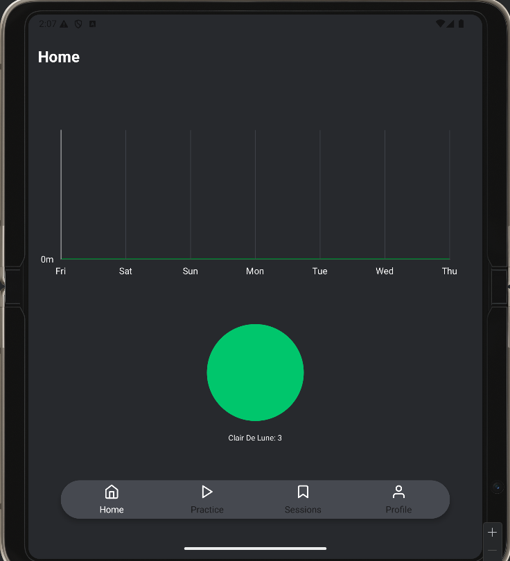
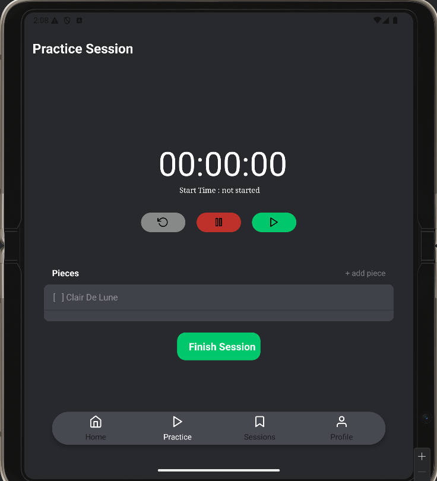
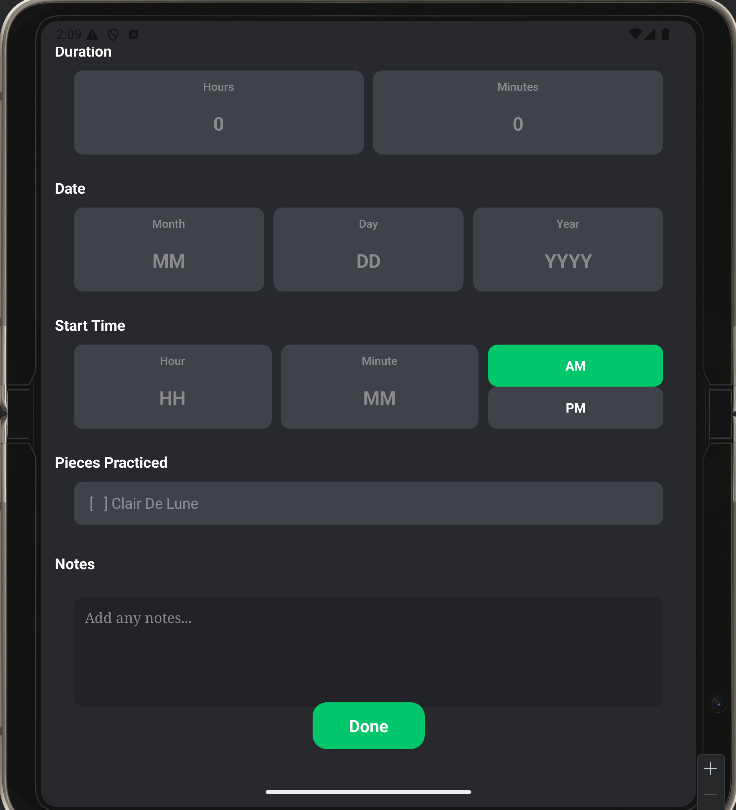
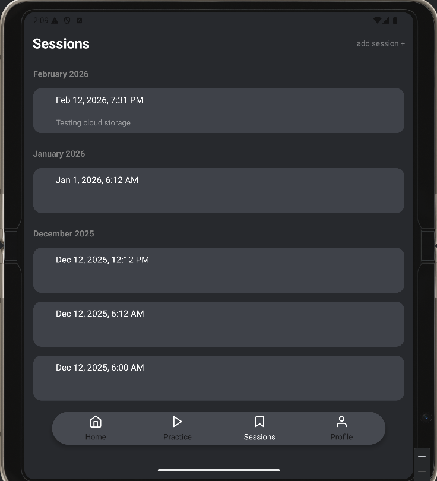
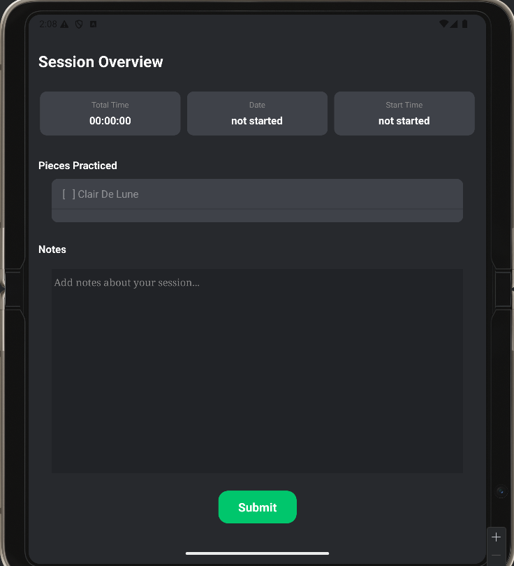

# MusiTrack - Practice Session Tracker

Musitrack is a cross platform mobile application built with the PERN Stack. This application offers a user-friendly application and platform for easy session tracking and anayltics.

## Screen Shots

## Targeted Audience
This project was made as a solution for musicians who want to organize, view, and track their practice progress with minimal effort, allowing more time to focus of musical practice and less time worrying about tracking.

## Features
- login and registration
- analytics dashboard
- tokenization
- password encryption
- session tracking and editing
- musical piece editing
- timer for real time practice session
- cloud syncronization

## Tech Stack
### Front End
- React - Component based UI and scalability
- Expo - Minimal screen routing and stack
### Back End
- Node.js + Express - Lightweight REST API
- Prisma - Type safe database queries and management
### Database
- PostgreSQL - reliable relational database for cloud storage
- SQLite - lightweight local database storage
### Cloud
- AWS - database hosting for automatic backup. scalability, and high availability

## current development
- developing and strengthening secure, accurate, and consistent cloud syncing feature
- planning more analytic features usful to musicians besides weekly duration graphs and number of times a piece has been practiced

## future plans
- deploy backend to AWS cloud services for scaling and reliablity
- publish application for public use